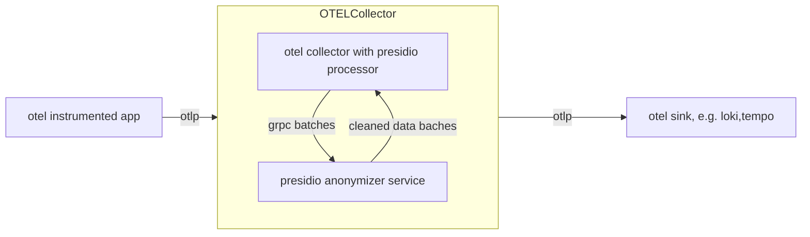

# Presidio OpenTelemetry Processor

This otel processor is used to detect and redact sensitive PII data in OpenTelemetry logs and traces send via otlp through a otel collector pipeline.
It is based on [Microsoft's Presidio](https://microsoft.github.io/presidio/) project.

### Redacted Logs


### Redacted Traces


## Architecture


This project consists of two main components:
1. The `presidioprocessor` package that is a custom otel processor that goes through the logs and traces and sends them to the `anonymizer` service via gRPC.
2. The `anonymizer` service that receives the logs and traces, detects and redacts sensitive data using Presidio in a batch manner, and sends the cleaned texts back to the processor.

## Build a custom otel collector with this processor

Use [OCB](https://opentelemetry.io/docs/collector/extend/ocb/) to build a custom otel collector with this processor. Below is an example of the OCB configuration file to build a custom otel collector with this processor.

```yml
dist:
  name: otelcol-dev
  description: Basic OTel Collector distribution for Developers
  output_path: ./otelcol-dev

exporters:
  - gomod:
      go.opentelemetry.io/collector/exporter/debugexporter v0.152.0
  - gomod:
      go.opentelemetry.io/collector/exporter/otlpexporter v0.152.0

processors:
  - gomod: go.opentelemetry.io/collector/processor/batchprocessor v0.152.0
  - gomod: github.com/mxab/otel-presidio/presidioprocessor v0.1.0 # include the processor in the build

receivers:
  - gomod:
      go.opentelemetry.io/collector/receiver/otlpreceiver v0.152.0

providers:
  - gomod:
      go.opentelemetry.io/collector/confmap/provider/envprovider v1.48.0
  - gomod:
      go.opentelemetry.io/collector/confmap/provider/fileprovider v1.48.0
  - gomod:
      go.opentelemetry.io/collector/confmap/provider/httpprovider v1.48.0
  - gomod:
      go.opentelemetry.io/collector/confmap/provider/httpsprovider v1.48.0
  - gomod:
      go.opentelemetry.io/collector/confmap/provider/yamlprovider v1.48.0

```
Here are [more details for the configuration](https://github.com/open-telemetry/opentelemetry-collector/tree/main/cmd/builder#configuration)

## Run the custom otel collector

After building the custom otel collector with the above configuration, you can run it with a configuration file that includes the `presidio` processor. 

```sh
./otelcol-dev --config your-config.yaml
```

Below is an example of the collector configuration file.

```yaml
receivers:
  otlp:
    protocols:
      grpc:
        endpoint: 0.0.0.0:4317
      http:
        endpoint: 0.0.0.0:4318

exporters:
  debug:
    verbosity: detailed
  
processors:
  presidio:
    endpoint: anonymizer:50051
    tls:
      insecure: true # currently tls is not supported
    attributes: # attributes to check for sensitive data and anonymize
      - "gen_ai.input.messages"
      - "gen_ai.output.messages"
    include_log_body: true  # whether to include log body in the anonymization process

service:
  pipelines: # consider adding routing and batching processors for better performance in production
    traces:
      receivers: [otlp]
      processors: [presidio]
      exporters: [debug]
    logs:
      receivers: [otlp]
      processors: [presidio]
      exporters: [debug]
```

See the [demo folder](./demo/) for a running example

### Run the anonymizer service
The anonymizer service is a gRPC server that listens for requests from the processor, detects and redacts sensitive data using Presidio, and sends the cleaned texts back to the processor. You can run it with the following command:

```sh
docker run -p 50051:50051 --name anonymizer --rm ghcr.io/mxab/otel-presidio:main
```

Currently you can specify `HOST` and `PORT` environment variables to change the default host and port of the anonymizer service.

## Thanks to this blog for the instructions on how to build a custom otel collector processor:

https://oneuptime.com/blog/post/2026-02-06-otel-custom-collector-processor/view
